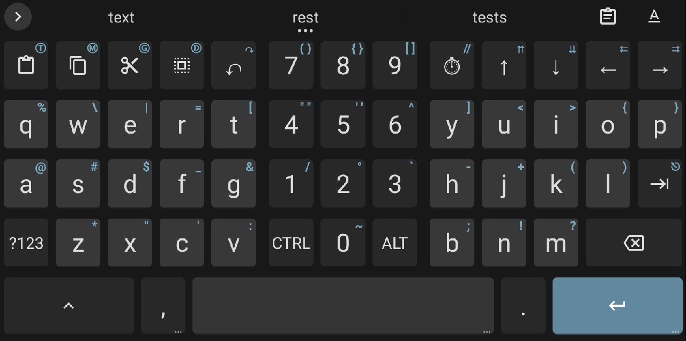
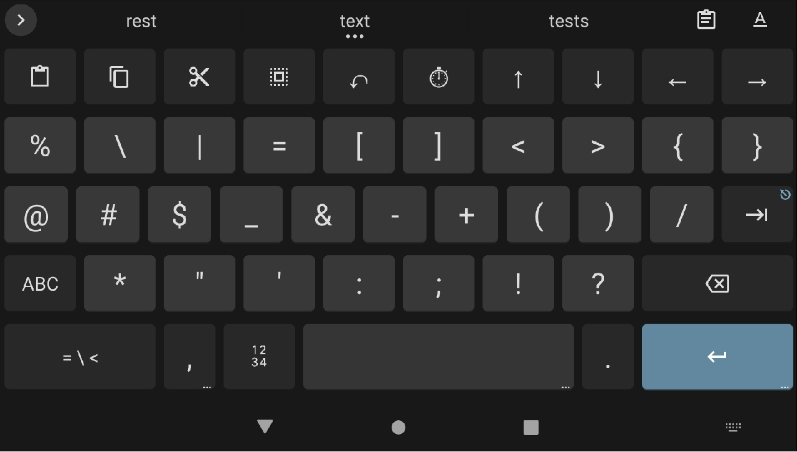
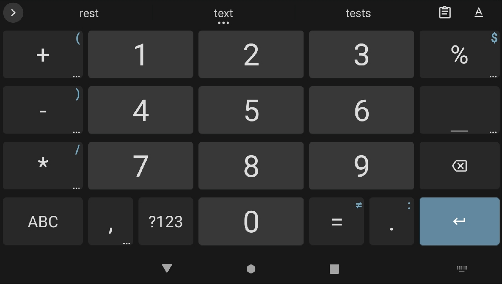
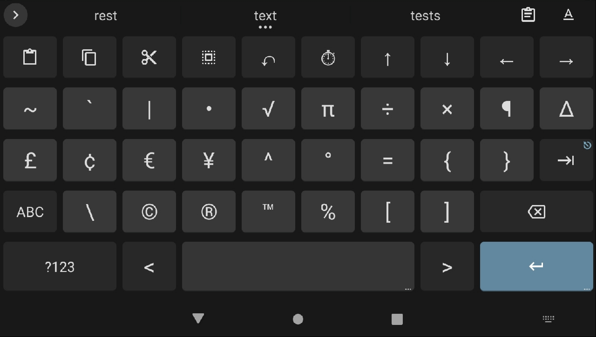

# Wide HB Keyboard

I like split-keyboard layouts on my Android tablets, but I do not like wasted space between the keyboard halves.  With multiple compilers on my tablets that I use for learning new languages and tweaking difficult algorithms, I've been looking for a keyboard that would work well for coding as well as for daily use.  As it is customizable (and private), [HeliBoard](https://github.com/HeliBorg/HeliBoard) fits the bill nicely.  Plus, I like it!  **Please note that this layout is not recommended for phones**.

To facilitate programming, I put the most used symbols on the keyboard so they are readily available and, I filled the split-keyboard void with number keys.  I also designed the layout with daily use in mind.  I hope everyone who uses Wide HB Keyboard finds it as useful as I do.  Feel free to make any changes you need, but don't try to push changes to this project (Fork it instead).  This layout is ideal for me and personal customization should be fairly easy for you to implement (you'll find the HeliBoard community eager to help).  For recommended Wide HB Keyboard customizations, see [Customizing](#customizing) below.

As long as I use HeliBoard ([and Gaggle doesn't close Android](https://keepandroidopen.org/)), I will keep Wide HB Keyboard up to date.  I expect we'll see great things from HeliBoard, but I'm sure there will be some growing pains that will render some of these custom layouts and techniques obsolete.  Please be patient as FOSS that helps protect your privacy, is well worth the wait.  If you create your own custom keyboard layouts, please share any tricks you find with the community.

<br>

## Screenshots

<!--
 
-->



| Symbols | Numbers | More Symbols |
|--|--|--|
|  |  |  |

<br>

## Please Note

- Starting at the top left, you'll see some long-press symbols (currently ```Ⓣ```, ```Ⓜ```, ```Ⓖ```, ```Ⓓ```).  These are for inputting email addresses.  You'll want to customize them to your own information/usage.  See [Customizing](#customizing) below.
- Redo (↷) is a long-press of Undo (↶).
- A few keys have double long-press symbols.  These are used for bracketing (sans ```// ``` &nbsp; which has a space after it for C-like comments).  As there is no cursor control available with custom keycodes (yet?), be sure to press the cursor back key (←) after using them.  That will put the cursor between the symbols ready for more input.
- The timestamp key (⏱) is formatted to input a date code suitable for file names (```yyyy-MM-dd_HH-mm-ss_```).  The final underline is because I precede archive file and directory names with timestamps.  Season to your taste.
- Each of the cursor control keys (top right of the keyboard) has a double-arrow of the quick-tap key symbol, which have the following functions when long-pressed:

	| Quick-Tap | Long-Press |
	| --- | --- |
	| Cursor Up (↑) | Ctrl-Home (⇈) &nbsp; &nbsp; &nbsp; |
	| Cursor Down (↓) | Ctrl-End (⇊) |
	| Cursor Left (←) | Home (⇇) |
	| Cursor Right (→) | End (⇉) |

	A side effect of the long-press on a repeating key (e.g., a cursor control key), is that the key no longer functions as a repeating key.  I find this acceptable as I use the spacebar for rapid cursor movement both horizontally and vertically.  Please note that using the spacebar for cursor movement only triggers cursor movement in one plane at a time.  E.g., to move vertically, you must start on the spacebar and drag up or down.  You cannot switch to horizontal cursor movement unless you lift your finger and start a new horizontal dragging motion on the spacebar.
- The Tab key long-press is Escape (⎋).
- As of this writing, the official HeliBoard documentation states that the 'CTRL' and 'ALT' keys are not sticky.  In fact, they now are.  Tap them a second time to cancel their shift-state.
- The rest of the keyboard is mostly default.  However, ```number_row``` has been heavily modified and must be kept on at all times for Wide HB Keyboard to function properly (see [Installation](#installation) below).  For those technically oriented, my saving grace here is that I discovered ```keyboard_state_selector``` actually works to hide keys (7, 8, 9, in this case), so keeping the ```number_row``` on persistently works great (see the [screenshots](#screenshots) above).
- I used the colors I like, which is, of course, subjective.  I generally use dark themes.  Any color combination you like should work fine.
- I've been programming computers since before the first IBM PC was introduced, so you may find terms you are unfamiliar with, like "directory" instead of "folder".  If anything is unclear, please let me know.  Sorry, some habits are difficult to change (and I don't want to)!

<br>

## Installation

Be sure to use the correct version of Wide HB Keyboard for the HeliBoard version you have installed.

| File | HeliBoard Version |
| -- | -- |
| HeliBoard_3-9_WideHB.zip | HeliBoard 3.9 |
| HeliBoard_4-0-alpha1_WideHB.zip | HeliBoard 4.0 alpha1 |

<br>

There are basically three ways to install Wide HB Keyboard; the [easy way](#easy-installation), the [hard way](#hard-installation), the [manual way](#manual-installation).  All have their benefits and drawbacks.

The [easy way](#easy-installation) is to simply restore my modified backup.  This technique will completely replace other custom layouts and, of course, your settings.  However, it should leave your custom dictionaries etc. untouched.  This procedure requires the least technical knowledge.

The [hard way](#hard-installation) will preserve all of your current custom layouts, dictionaries, etc., but it requires more technical skill.

The [manual way](#manual-installation) is much more involved and I will not walk you through this technique.

As HeliBoard currently stands, I recommend the [easy way](#easy-installation).  The trick is to keep custom restore files of each layout, then restore these files as you need them ([see creating custom restore files](CustomRestore.md)).  I do not recommend this technique for everyday use, but for major paradigm shifts and for testing new layouts.

<br>

### Easy Installation

I have not seen installations done like this before (I may have missed it), so please let me know if you discover any issues.  The procedure is very simple.  If you create and want to share your custom HeliBoard keyboards this way too, [see creating custom restore files](CustomRestore.md).

To install Wide HB Keyboard the easy way, follow these steps.  Remember, this procedure will replace all your current custom layouts and settings, but _should_ preserve your custom dictionaries, etc.:
1. Do a full backup of your current HeliBoard setup ```[HeliBoard Settings->Advanced->Backup and restore->Backup]```.
2. Download the correct Wide HB Keyboard version raw file from [this GitHub package](https://github.com/Trasd/Wide-HB-Keyboard).
	- Feel free to manually unzip the restore file and check it out if you are concerned with security issues.
3. Install Wide HB Keyboard by going to ```[HeliBoard Settings->Advanced->Backup and restore->Restore]``` and choosing ```HeliBoard_version_WideHB.zip``` from the directory where you downloaded it.
	- You may get an error stating only one loop can be run at a time.  You can safely ignore this error (from my experience).
4. [Confirm](#confirm-proper-installation) Wide HB Keyboard's installation.
5. That's it.  Proceed with [Customizing](#customizing) below.

<br>

### Hard Installation

Like the easy installation, this procedure is also largely untested.  Please report any issues you may encounter.

The steps below can get very confusing, so please make sure you understand them before continuing.  As is usual with this sort of thing, it is much harder to explain the steps than actually do them.  What you are basically doing is combining Wide HB Keyboard's files with your backed up HeliBoard files, then restoring the resulting zipped file to HeliBoard; you are making your own custom restore file.  Custom restore files are more fully explained [here](CustomRestore.md).

This installation is a bit more technical than the easy installation, but it should preserve your current custom layouts, dictionaries, etc., only adding my layout and changing your settings to better work with Wide HB Keyboard.

1. Do a full backup of your current HeliBoard setup ```[HeliBoard Settings->Advanced->Backup and restore->Backup]```.  It will be named like ```HeliBoard_backup_yyyy-mm-dd.zip```, where ```yyyy``` is the year, ```mm``` is the numeric month, and ```dd``` is the numeric day of the month of the backup.
2. Download the correct Wide HB Keyboard version raw file from [this GitHub package](https://github.com/Trasd/Wide-HB-Keyboard).
	- Feel free to manually unzip the restore file and check it out if you are concerned with security issues.
3. Copy your backup (from step 1: ```HeliBoard_backup_yyyy-mm-dd.zip```) into an empty working directory.  **Please keep a separate copy of your backup in a safe place.**
4. Copy the ```HeliBoard_version_WideHB.zip``` file from step 2 into the same working directory as step 3.
5. From inside of your working directory, unzip both files (the copy of your backup ```HeliBoard_backup_yyyy-mm-dd.zip``` and ```HeliBoard_version_WideHB.zip```).
	- As a sanity check, make sure the root of your working directory has these four items:
    	- A copy of your HeliBoard backup (```HeliBoard_backup_yyyy-mm-dd.zip```)
    	- An unzipped directory of your HeliBoard backup (```HeliBoard_backup_yyyy-mm-dd```)
    	- ```HeliBoard_version_WideHB.zip```
    	- A directory called ```HeliBoard_version_WideHB``` that was unzipped from ```HeliBoard_version_WideHB.zip```.
6. Delete the two files (```HeliBoard_backup_yyyy-mm-dd.zip``` and ```HeliBoard_version_WideHB.zip```) leaving just the two directories.
7. Inside of the ```HeliBoard_version_WideHB``` directory, you will find two items:
	- ```unprotected``` [directory]
	- ```preferences.json``` [file]  

	Copy these two items to your unzipped backup directory (```HeliBoard_backup_yyyy-mm-dd```) in your working folder.  If this was done correctly, you should get one conformation asking if ```preferences.json``` should be overwritten (yes, it should be overwritten).
This step **adds** three files to your ```HeliBoard_backup_yyyy-mm-dd``` directory:
	- ```/unprotected/layouts/functional/custom.y2geg9hdu.```
	- ```/unprotected/layouts/main/custom.y2geg9hdu.```
	- ```/unprotected/layouts/number_row/custom.y2geg9hdu.```

	and replaces one:
	- ```/preferences.json```
8. Now you must zip your ```HeliBoard_backup_yyyy-mm-dd``` directory, but from within the directory!  Let me explain:  If you zip your ```HeliBoard_backup_yyyy-mm-dd``` from outside of the directory, your zipped directory structure will be incorrect.  Zipped from within the first subdirectory of ```HeliBoard_backup_yyyy-mm-dd```, your zipped directory structure should look like the following when you open or unzip it (I'm only showing the root directory level):
	- ```unprotected``` [directory]
	- ```UserHistoryDictionary.en-US.dict``` [directory]
	- ```heliboard.db``` [file]
	- ```preferences.json``` [file]
	- ```protected_preferences``` [file]
  
	In other words, the name of the zipped file would be ```HeliBoard_backup_yyyy-mm-dd```, and the list above would be what is compressed.

	You can actually name your zipped file whatever you wish, but just make sure you restore the correct zipped file in the next step.
9.  Install your new custom restore file by going to ```[HeliBoard Settings->Advanced->Backup and restore->Restore]``` and choosing ```HeliBoard_backup_yyyy-mm-dd.zip``` (or whatever you named your zip file from step 8) from your working directory.
	- You may get an error stating only one loop can be run at a time.  You can safely ignore this error (from my experience).
10.  [Confirm](#confirm-proper-installation) Wide HB Keyboard's installation.
11.  That's it.  Proceed with [Customizing](#customizing) below.
12.  If the installation failed, either try the [easy way](#easy-installation) or read [this guide](CustomRestore.md) to understand custom restore files further.

<br>

### Manual Installation

As I said above, the manual installation is much more involved and I will not walk you through this technique, but refer you to [HeliBoard's Wiki](https://github.com/HeliBorg/HeliBoard/wiki).

If you choose this method, please, at a minimum, set these settings or Wide HB Keyboard will not work as expected:
- Make sure ```[HeliBoard Settings->Appearance->Enable split keyboard]``` is **disabled** for both portrait and landscape orientations.
- Make sure ```[HeliBoard Settings->Preferences->Number row, always show number row]``` is **enabled**.

<br>

## Confirm Proper Installation

Proper installation is easy to verify.  Just open the keyboard and make sure it matches the [picture](#screenshots) at the top of this readme.  If the picture doesn't match, check your settings:
- Go to ```[HeliBoard Settings->Languages & Layouts English (US) (XX)->English (US) (XX) Custom subtype]``` (where ```XX``` _should_ be your active keyboard), then:
  - In the ```[Layout]``` drop-down menu, make sure WideHB is there and selected.
  - In the ```[Functional keys]``` drop-down menu, make sure WideHB is there and selected.
  - In the ```[Number row]``` drop-down menu, make sure WideHB is there and selected.

If WideHB is not in the above drop-down menus, please restore your settings and try again.  If you cannot get the Wide HB Keyboard installed, please let me or the community know.

<br>

## Customizing

Not much needs to be done in the way of customizing Wide HB Keyboard to make it yours.  I strongly recommend changing the email shortcuts to your own addresses.  I use four emails on a regular basis, but you can change the keys' functions to anything you want.

Once you confirm Wide HB Keyboard is [installed](#installation), follow these steps to change the email addresses:
1. Do a full backup of your current HeliBoard setup ```[HeliBoard Settings->Advanced->Backup and restore->Backup]```.
2. Go to ```[HeliBoard Settings->Languages & Layouts English (US) (WideHB)->English (US) (WideHB) Custom subtype->Number row WideHB]``` and tap the pencil.  This will bring up the ```[Number row]``` edit box.
3. In the ```[Number row]``` edit box, look for:
	- ```..."label": "Ⓣ|YourEmail@tutamail.com"...```
	- ```..."label": "Ⓜ|YourEmail@msn.com"...```
	- ```..."label": "Ⓖ|YourEmail@gmail.com"...```
	- ```..."label": "Ⓓ|YourEmail@duck.com"...```

	and change each of the email address entries to whatever you want.
4. When you are done, simply tap ```[Save]```.

The ```Ⓣ```, ```Ⓜ```, ```Ⓖ```, and ```Ⓓ``` can be replaced with your own Unicode characters, but if you want to stick with the circled letters, they are between 24B6 (```Ⓐ```) and 24CF (```Ⓩ```).
